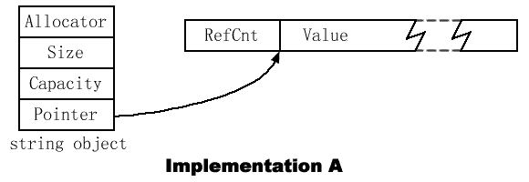
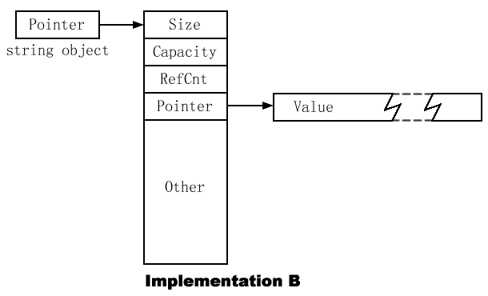
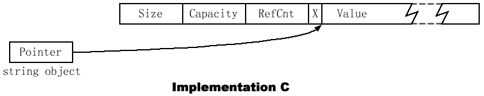
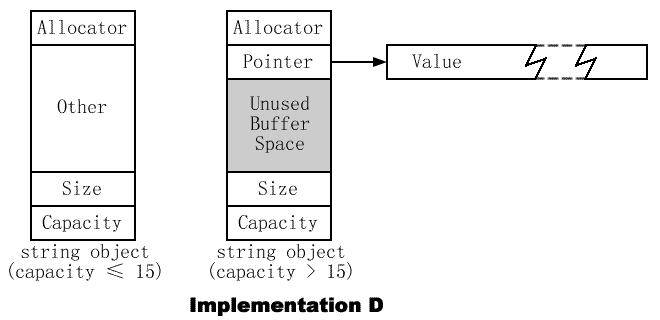

> ## 13 尽量使用vector和string来代替动态分配的数组

> ## 14 使用reserve来避免不必要的重新分配
* 只要不超过STL容器的最大大小，就可以自动增长到足以容纳放进去的数据，这个最大值可以调用max_size成员函数查看
* 对于vector和string，需要更多空间时就以realloc等价的思想来增长，这个类似于realloc的操作有四个部分，这些步骤发生时所有指向vector或string中的迭代器、指针和引用都会失效
  * 分配新的内存块，它有容器目前容量的几倍。大部分实现中vector和string的容量每次以2为因数增长，即翻倍
  * 把所有元素从容器的旧内存拷贝到新内存
  * 销毁旧内存中的对象
  * 回收旧内存
* resize把size改为n，n<size则尾部元素被销毁，否则重新分配，默认构造的新元素会添加到容器尾部。reserve把capacity改为n，如果n<capacity，对vector这个调用什么都不做，string把容量减少为size和n中大的数，但size不变
```cpp
size();
capacity();
resize(Container::size_type n);
reserve(Container::size_type n);
```
* 假定不使用reserve建立一个容纳1-1000vector<int>，循环过程中将会导致2到10次重新分配（1000约等于2^10）
```cpp
vector<int> v;
for (int i = 1; i <= 1000; ++i) v.push_back(i);
```
* 代码改为使用reserve则不会有重新分配
```cpp
vector<int> v;
v.reserve(1000);
for (int i = 1; i <= 1000; ++i) v.push_back(i);
```
* 注意，reserve只是改动空间大小，而不能直接用下标赋值
```cpp
vector<int> v;
v.reserve(4);
v[0] = 2; // 下标溢出
v[3] = 1; // 下标溢出
```
* 用下标赋值的正确做法如下
```cpp
vector<int> v(4); // v中包含4个0
v[0] = 2;
v[3] = 1;
```
* 大小和容量之间的关系可以预测重新分配的时机，避免插入使指向容器中的迭代器、指针和引用失效
```cpp
string s;
...
if (s.size() < s.capacity()) {
    s.push_back('x'); // 不会使容器的迭代器失效
}
```

> ## 15 小心string实现的多样性
* string对象的大小可能是1到至少7倍char*指针的大小，为了理解存在差别的原因，必须知道string可能存的数据和保存的位置
* 实际上每个string实现都容纳了下面的信息，不同的string实现以不同的方式把这些信息放在一起
  * 字符串的大小
  * 容纳字符串字符的内存容量
  * 这个字符串的值，即构成这个字符串的字符。
  * 一个string可能容纳它的配置器的拷贝
  * 依赖引用计数的string实现包含了这个值的引用计数
* 实现A中，每个string对象包含一个配置器的拷贝，字符串的大小，容量，和一个指向包含引用计数和字符串值的动态分配的缓冲区的指针。这里一个使用默认配置器的字符串对象是指针大小的四倍，对于一个自定义的配置器，string对象会随配置器对象的增大而变大



* 实现B的string对象和指针一样大，因为在结构体中只包含一个指针。这里仍然假设使用默认配置器。正如实现A，如果使用自定义配置器，这个string对象的大小会增加大约配置器对象的大小。实现B中，使用默认配置器不占用空间，这归功于这里用了一个在实现A中没有的使用优化。B的string指向的对象包含字符串的大小、容量和引用计数，以及容纳字符串值的动态分配缓冲区的指针，也包含在多线程系统中与并发控制有关的一些附加数据，用于并发控制的数据是一个指针大小的6倍



* 实现C的string对象总是等于指针的大小，但是这个指针指向一个包含所有与string相关的东西的动态分配缓冲器：它的大小、容量、引用计数和值。没有per-object allocator的支持。缓冲区也容纳一些关于值可共享性的数据，我们在这里不考虑这个主题，标记为“X”



* 实现D的string对象是一个指针大小的七倍（仍然假设使用了默认配置器）。这个实现没有使用引用计数，但每个string包含了一个足以表现最多15个字符的字符串值的内部缓冲区，因此小的字符串可以被整个保存在string对象中，这是一种优化策略，当一个string的容量超过15时，缓冲器的第一部分被用作指向动态分配内存的一个指针，而字符串的值存放在那块内存中。在VS中空string的size就是15，sizeof(string)是28



* 实现D没有动态分配，实现A和C下一次，实现B下两次（一次是string对象指向的对象，一次是那个对象指向的字符缓冲区），因此新字符串值的建立可能需要0、1或2次动态分配。如果关心动态分配和回收内存的次数，或伴随这样分配的内存开销，避开实现B

> ## 16 如何将vector和string的数据传给遗留的API
* 如果有一个vector对象v，需要得到一个指向v中数据的指针，使得它可以被当作一个数组，只要使用&v[0]就可以了，对于string对象s，相应的是的s.c_str()
* 如果对于数组
```cpp
void f(const int* pInts, size_t numInts);
```
* 改成vector要考虑v.size()为0的情况，因为&v[0]将是未定义的
```cpp
if (!v.empty()) {
    doSomething(&v[0], v.size());
}
```
* begin的返回类型是iterator，而不是一个指针，需要一个指向vector内部数据的指针时绝不该使begin，如果键入v.begin()，就应该键入&*v.begin()，而这产生和&v[0]相同的指针，却显得更晦涩
* 对string来说则不用考虑，因为string长度为0也能工作，c_str()将返回一个指向null字符的指针，但这会被解释为字符串结束，对char*有影响
```cpp
void doSomething(const char *pString);
doSomething(s.c_str());
```
* 如果想用C风格函数返回的元素初始化一个vector，可以利用vector和数组内存分布的兼容性将存储vector元素的空间传给函数
```cpp
size_t fillArray(double *pArray, size_t arraySize);
vector<double> vd(maxNumDoubles);
vd.resize(fillArray(&vd[0], vd.size()));
```
* 这个技巧只能用于vector，因为只有vector承诺了与数组具有相同的潜在内存分布。如果想初始化string对象，只要让API将数据放入一个vector<char>，然后从vector中将数据拷到string
```cpp
size_t fillString(char *pArray, size_t arraySize);
vector<char> vc(maxNumChars);
size_t charsWritten = fillString(&vc[0], vc.size());
string s(vc.begin(), vc.begin()+charsWritten);
```
* 让C风格API把数据放入一个vector，然后拷到STL容器的做法总是有效的
```cpp
size_t fillArray(double *pArray, size_t arraySize);
vector<double> vd(maxNumDoubles);
vd.resize(fillArray(&vd[0], vd.size()));
deque<double> d(vd.begin(), vd.end());
list<double> l(vd.begin(), vd.end());
set<double> s(vd.begin(), vd.end());
```
* 反之，vector和string以外的STL容器要将数据传给C风格API，只要把数据拷到vector再传给API
```cpp
void doSomething(const int* pints, size_t numInts);
set<int> intSet;
...
vector<int> v(intSet.begin(), intSet.end());
if (!v.empty()) doSomething(&v[0], v.size());
```

> ## 17 使用“交换技巧”来修整过剩容量
* 要避免vector持有不再需要的内存，需要把它从曾经最大的容量减少到现在需要的容量，这样减少容量的方法常被称为shrink to fit，C++11加入了shrink_to_fit函数，实现起来其实很简单
```cpp
vector<Contestant>(contestants).swap(contestants);
```
* 新建一份临时vector，只会拷贝已有元素，所以临时vector没有多余容量，再交换，接着就被销毁，这样以前的vector就收缩完成了。string也是同理
```cpp
string s;
... // 使s变大，然后删除所有字符
string(s).swap(s);
```
* 同理，交换技巧的变体可以用于清除容器和减少它的容量到实现提供的最小值
```cpp
vector<Contestant> v;
string s;
... // 使用v和s
vector<Contestant>().swap(v); // 清除v并最小化容量
string().swap(s); // 清除s并最小化容量
```

> ## 18 避免使用vector<bool>
* vector<bool>只有两个问题。第一，它不是一个STL容器。第二，它并不容纳bool
* STL容器就必须满足所有在C++标准23.1节中列出的容器必要条件。这些要求中有这样一条：如果c是一个T类型对象的容器，且c支持operator[]，那么以下代码必须能够编译
```cpp
T *p = &c[0]; // 无论operator[]返回什么都可以用这个地址初始化一个T*
```
* 换句话说，如果用operator[]来得到Container<T>中的一个T对象，可以通过取它的地址而获得指向那
个对象的指针。因此如果vector<bool>是一个容器，以下代码必须能够编译
```cpp
vector<bool> v;
bool *pb = &v[0]; // 用vector<bool>::operator[]返回值的的地址初始化一个bool*
```
* 但它不能编译，vector<bool>是一个伪容器，并不保存真正的bool，而是打包bool以节省空间。在一个典型的实现中，每个保存在“vector”中的“bool”占用一个单独的bit，而一个8bit的字节将容纳8个bool。在内部，vector<bool>使用了与位域等价的思想来表示它假装容纳的bool
* ，vector<bool>::operator[]需要返回指向一个比特的引用，而并不存在这样的东西。为了解决这个难题，vector<boo>::operator[]返回一个对象，其行为类似于比特的引用，也称为代理对象
```cpp
template <typename Allocator>
vector<bool, Allocator> {
public:
    class reference {...}; // 用于产生引用独立比特的代理类
    reference operator[](size_type n); // operator[]返回一个代理
    ...
}
```
* 而这样，代码不能编译的原因就很明显了，因为&v[0]是vector<bool>::reference\*类型而非bool\*
* vector<bool>存在于标准中，而它并不是一个容器，标准库提供了两个替代品，分别是deque<bool>和bitset。deque<bool>是一个STL容器，它保存真正的bool值。bitset不是一个STL容器，大小（元素数量）在编译期固定，因此它不支持插入和删除元素，但就像vector<bool>，它使用一个压缩的表示法，使得它包含的每个值只占用一比特，提供vector<bool>特有的flip成员函数，还有一系列其他操作位集（collection of bits）所特有的成员函数。如果不在乎没有迭代器和动态改变大小，可以使用bitset
