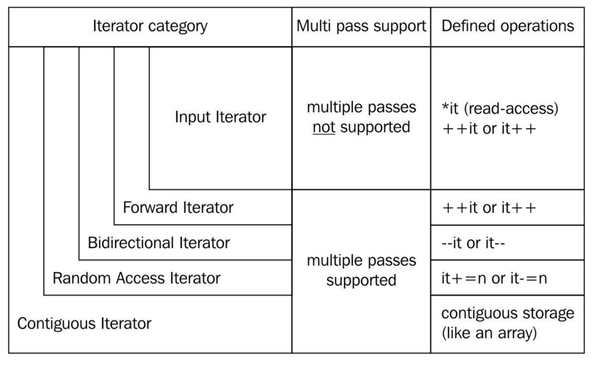
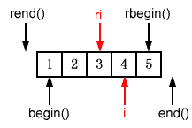
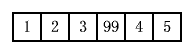

* 输入迭代器：只能用来读取指向的值。当该迭代器自加时，之前指向的值就不可访问。也就是说，不能使用这个迭代器在一个范围内遍历多次。std::istream_iterator就是这样的迭代器
* 前向迭代器：类似于输入迭代器，不过其可以在指示范围内迭代多次。`std::forward_list`就是这样的迭代器。就像一个单向链表一样，只能向前遍历，不能向后遍历，但可以反复迭代
* 双向迭代器：从名字就能看出来，这个迭代器可以自增，也可以自减，迭代器可以向前或向后迭代。`std::list`，`std::set`和`std::map`都支持双向迭代器
* 随机访问迭代器：与其他迭代器不同，随机访问迭代器一次可以跳转到任何容器中的元素上，而非之前的迭代器，一次只能移动一格。`std::vector`和`std::deque`的迭代器就是这种类型
* 连续迭代器：这种迭代器具有前述几种迭代器的所有特性，不过需要容器内容在内存上是连续的，类似一个数组或`std::vector`
* 输出迭代器：该迭代器与其他迭代器不同。因为这是一个单纯用于写出的迭代器，其只能增加，并且将对应内容写入文件当中。如果要读取这个迭代中的数据，那么读取到的值就是未定义的
* 可变迭代器：如果一个迭代器既有输出迭代器的特性，又有其他迭代器的特性，那么这个迭代器就是可变迭代器。该迭代器可读可写。如果我们从一个非常量容器的实例中获取一个迭代器，那么这个迭代器通常都是可变迭代器

> ## 26 尽量用iterator代替const_iterator，reverse_iterator和const_reverse_iterator
* insert和erase的一些版本要求iterator，而不能用const_iterator或reverse_iterator
* 从reverse_iterator转换而来的iterator在转换之后可能需要相应的调整
* 不可能把const_iterator隐式转换成iterator
```cpp
typedef deque<int> IntDeque;
typedef IntDeque::iterator Iter;
typedef IntDeque::const_iterator ConstIter;
Iter i;
ConstIter ci;
if (i == ci) ... // iterator隐式转换成const_iterator再比较
// 而有时编译器把operator==作为const_iterator的一个成员函数
// 上面的代码就无法编译，解决方法是交换两个迭代器位置
if (ci == i)...
```
* 只要混用iterator和const_iterator，上面的问题就可能出现，避免这类问题的最简单的方法是减少混用不同类型的迭代器的机会
```cpp
if (i - ci >= 3) ...
// 如果无法编译则需要把iterator转为const_iterator
if (static_cast<ConstIter>(i) - ci >= 3) ...
// 最简单的做法就是不要混用iterator和const_iterator
```

> ## 27 用distance和advance把const_iterator转化成iterator
* 如果只有一个const_iterator，而要在它指向的容器位置上插入新元素，需要把const_iterator转化为iterator。并不存在从const_iterator到iterator之间的隐式转换，用const_cast也不行，因为iterator和const_iterator是完全不同的类
* 下面是解决思路
```cpp
typedef deque<int> IntDeque;
typedef IntDeque::iterator Iter;
typedef IntDeque::const_iterator ConstIter;
IntDeque d;
ConstIter ci;
... // 让ci指向d
Iter i(d.begin()); // 初始化i为d.begin()
advance(i, distance(i, ci)); // 把i移到指向ci位置
```
* 但这段代码还不能编译。先看distance的定义
```cpp
template<typename InputIterator>
typename iterator_traits<InputIterator>::difference_type
distance(InputIterator first, InputIterator last);
```
* 可见传递给distance的两个参数类型必须相同，因此要顺利地调用distance，显式指定类型即可
```cpp
advance(i, distance<ConstIter>(i, ci));
```
* 对于随机访问的迭代器（比如vector、string和deque的）而言，这是常数时间的操作。对于双向迭代器（list、set、multiset、map、multimap）而言，这是线性时间的操作

> ## 28 了解如何通过reverse_iterator的base得到iterator
* reverse_iterator::base指向反向迭代器的base iterator，即当前所在位置往右一个位置
```cpp
vector<int> v;
v.reserve(5);
for(int i = 0；i < 5; ++ i) v.push_back(i);
vector<int>::reverse_iterator ri = find(v.rbegin(), v.rend(), 3);
vector<int>::iterator i(ri.base()); // 使i和ri的base一样
```



* 有些容器的成员函数只接受iterator类型参数，比如要在ri所指的位置插入元素时，vector的insert函数会拒绝reverse_iterator，删除同理，因此必须先通过base函数将reverse_iterator转换成iterator
* 比如要在ri的位置插入99，因为是从右往左遍历，即倒数第三个位置，插入后内容如下



* ri指向3时，ri.base()指向4，因此直接插入到ri.base()即可
* 如果要删除ri，则删除的是ri.base()的往左一个元素
```cpp
vector<int> v;
v.reserve(5);
for(int i = 0；i < 5; ++ i) v.push_back(i);
vecot<int>::reverse_iterator ri = find(v.rbegin(), v.rend(), 3);
v.erase(--ri.base());
```
* 但上述代码对于大多数vector和string的实现，无法通过编译，因为这样的实现下，iterator和const_iterator会采用内建指针实现，所以ri.base()的结果是一个指针。为了避免修改base的返回值，只需要先增加reverse_iterator的值，然后再调用base
```cpp
v.erase((++ri).base());
```

> ## 29 需要一个一个字符输入时考虑使用istreambuf_iterator
* 把一个文本文件拷贝到一个字符串对象
```cpp
ifstream inputFile("interestingData.txt");
string fileData((istream_iterator<char>(inputFile)),  istream_iterator<char>());
```
* 但这样无法把文件中的空格拷贝到字符串中，因为istream_iterators使用operator>>函数读取，默认情况下忽略空格，想保留空格，覆盖默认情况，清除输入流的skipws标志即可
```cpp
ifstream inputFile("interestingData.txt");
inputFile.unset(ios::skipws); // 关闭inputFile的忽略空格标志
string fileData((istream_iterator<char>(inputFile)), istream_iterator<char>());
```
* 现在所有字符都能拷贝了，但拷贝速度可能不快。istream_iterators依靠的operator>>函数进行的是格式化输入，每次调用时要做大量工作。它们必须建立和销毁岗哨（sentry）对象（为每个operator>>调用进行建立和清除活动的特殊的iostream对象），检查可能影响行为的流标志（比如skipws），进行全面的读取错误检查，如果遇到问题必须检查流的异常掩码决定是否抛出异常。如果进行格式化输入，这些活动很重要，但只是从输入流中抓取下一个字符就过度了
* 更高效的方法是使用istreambuf_iterators。istreambuf_iterator<char> 对象从一个istream s中读取会调用s.rdbuf()->sgetc()读s的下一个字符。istreambuf_iterator不忽略任何字符，它们只抓取流缓冲区的下一个字符，因此不需要unset skipws标志符
```cpp
ifstream inputFile("interestingData.txt");
string fileData((istreambuf_iterator<char>(inputFile)), istreambuf_iterator<char>());
```
