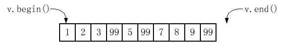
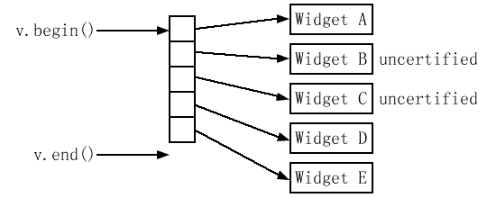

> ## 30 确保目标区间足够大
* STL容器在被添加时（通过insert、push_front、push_back等）自动扩展来容纳新对象，许多人便认为不必为容器中的对象腾出空间担心
```cpp
int f(int x); // 此函数从x产生一些新值
vector<int> values;
... // 把数据放入values
vector<int> results;
transform(values.begin(), values.end(), results.end(), f);
```
* 上述代码存在bug，transform的目的区间从results.end()开始，而*results.end()没有对象，给不存在的对象赋值是错误的，犯这种错误的程序员几乎总是以为他们调用算法的结果能插入目标容器。这里把transform的结果放入results容器的结尾的方法是调用back_inserter来产生指定目标区间起点的迭代器
```cpp
vector<int> results;
transform(values.begin(), values.end(), back_inserter(results), f);
```
* 在内部，back_inserter返回的迭代器会调用push_back，所以可以在任何提供push_back的容器上使用back_inserter（即标准序列容器：vector、string、deque和list）。如果想让一个算法在容器的前端插入，可以使用front_inserter。在内部，front_inserter利用了push_front，所以front_insert只能和有push_front的容器配合（也就是deque和list）
```cpp
list<int> results; // results现在是list
// 在results前端反序插入
transform(values.begin(), values.end(), front_inserter(results), f);
```
* 如果要transform把输出结果放在前端，且输出和values中的顺序相同，以相反的顺序迭代values即可
```cpp
list<int> results;
transform(values.rbegin(), values.rend(), front_inserter(results), f);
```
* inserter允许算法把结果插入容器中的任意位置
```cpp
vector<int> values;
...
vector<int> results;
...
// 插入到results中间
transform(values.begin(), values.end(), inserter(results, results.begin() + results.size()/2), f);
```
* 插入vector或string时，可以预先调用reserve，虽然仍要承受每次发生插入时移动元素的开销，但至少避免了重新分配容器的内在内存
```cpp
vector<int> values;
vector<int> results;
...
results.reserve(results.size() + values.size()); // 保证results至少还能装得下values.size()个元素
transform(values.begin(), values.end(), inserter(results, results.begin() + results.size() / 2), f);
```
* reserve只增加容器的容量，大小未变。忽视这点容易再次犯最初的错误
```cpp
vector<int> values;
vector<int> results;
...
results.reserve(results.size() + values.size());
transform(values.begin(), values.end(), results.end(), f);
```
* 正确的做法仍是使用插入迭代器
```cpp
vector<int> values;
vector<int> results;
results.reserve(results.size() + values.size());
transform(values.begin(), values.end(), back_inserter(results), f);
```
* 有时要覆盖现有容器元素而不是插入新的，此时不需要插入迭代器，但仍要确保目的区间足够大
```cpp
vector<int> values;
vector<int> results;
...
if (results.size() < values.size()) results.resize(values.size());
transform(values.begin(), values.end(), results.begin(), f);
```
* 或者清空results再用通常方式使用插入迭代器
```cpp
...
results.clear();
results.reserve(values.size());
transform(values.begin(), values.end(), pack_inserter(results), transmogrify);
```

> ## 31 了解你的排序选择
* 很多程序员排序对象时，只会想到sort算法，但有时候不需要完全排序。如果有一个Widget的vector，要选出20个质量最高的Widget，只要排序以鉴别出20个最好的Widget，剩下的可以保持无序，这样的部分排序可以使用partial_sort算法
```cpp
bool qualityCompare(const Widget& lhs, const Widget& rhs)
{
    // 返回lhs的质量是不是比rhs的质量好
}
// 把最好的20个元素按顺序放在widgets的前端
partial_sort(widgets.begin(), widgets.begin() + 20, widgets.end(), qualityCompare);
```
* partial_sort后，widgets的前20个元素是容器中最好的且按顺序排列，质量最高的是widgets[0]，但如果只要选出前20个最好的而不需要排序，使用nth_element算法
```cpp
nth_element(widgets.begin(), widgets.begin() + 19, widgets.end(), qualityCompare);
```
* 当有元素有同样质量的时候，比如有12个质量最好，15个质量其次，此时选择20个的做法是选12个最好的和8个其次的，而从15个中选8个的做法是随机的，partial_sort、nth_element、sort都是不稳定的。排序时使用stable_sort可以稳定排序，但STL不包含partial_sort和nth_element的稳定版本
* nth_element除了能找到区间顶部的n个元素，还可以用于找到区间的中值或者找到在指定百分点的元素
```cpp
vector<Widget>::iterator begin(widgets.begin());
vector<Widget>::iterator end(widgets.end()); 
vector<Widget>::iterator goalPosition;
goalPosition = begin + widgets.size() / 2;
nth_element(begin, goalPosition, end, qualityCompare);
... // goalPosition现在指向中等质量等级的Widget
// 下面的代码能找到质量等级为75%的Widget
vector<Widget>::size_type goalOffset = 0.25 * widgets.size();
nth_element(begin, begin + goalOffset, end,
qualityCompare);
... // begin + goalOffset现在指向质量等级为75%的Widget
```
* 如果不需要鉴别出20个质量最高的Widget，而是鉴别出所有质量等级为1或2的，使用partition算法，它重排区间中的元素使所有满足条件的元素都在区间的开头
```cpp
bool hasAcceptableQuality(const Widget& w)
{
    // 返回w质量等级是否是2或更高;
}
// 把所有满足hasAcceptableQuality的widgets移动到widgets前端
// 并且返回一个指向第一个不满足的widget的迭代器
vector<Widget>::iterator goodEnd = 
    partition(widgets.begin(), widgets.end(), hasAcceptableQuality);
```
* sort、stable_sort、partial_sort和nth_element需要随机访问迭代器，所以它们只能用于vector、string、deque和数组，对关联容器没有意义，唯一我们可能会但不能使用这些算法的容器是list，list提供sort成员函数作为补偿（且list::sort提供了稳定排序），而如果你想要对list中的对象进行partial_sort或nth_element，必须间接完成，一个方法是把元素拷贝到一个支持随机访问迭代器的容器中再对其用算法，另一个方法是建立一个list::iterator容器，对容器使用算法，然后通过迭代器访问list元素，第三种方法是使用有序的迭代器容器的信息来迭代地把list的元素接合到想让它们所处的位置
* partition和stable_partition与sort、stable_sort、partial_sort和nth_element不同，它们只需要双向迭代器，因此可以在任何标准序列迭代器上使用partition和stable_partition

> ## 32 如果你真的想删除东西的话就在类似remove的算法后接上erase
* remove接收一对迭代器而不接收一个容器，所以remove不知道它作用于哪个容器，从容器中删除元素的唯一方法是调用容器的一个成员函数，几乎都是erase的某个形式（list有几个除去元素的成员函数不叫erase） ，从一个容器中remove元素不会改变容器中元素的个数
```cpp
vector<int> v;
v.reserve(10);
for (int i = 1; i <= 10; ++i) v.push_back(i);
cout << v.size(); // 打印10
v[3] = v[5] = v[9] = 99;
remove(v.begin(), v.end(), 99); // 删除所有等于99的元素
cout << v.size(); // 仍然是10
```
* remove并不真的删除东西，remove不知道它要从哪个容器删除东西，而没有容器就没有办法调用成员函数
* remove移动区间中的元素直到所有“不删除的”元素在区间的开头，返回指向最后一个“不删除的”元素的下一个位置的迭代器，即区间的“新逻辑终点”




* remove并没有改变区间中元素的顺序，不会把“删除的”元素放在结尾


* 实际上可以remove完成了一种压缩，对于上述vector，remove过程如下
  * 检查v[0]，发现它的值不是要被删除的，继续后移
  * 直到发现应该被删除的v[3]，便认为v[3]是一个洞，继续移到v[4]
  * 发现v[4]不用删除，就把v[4]赋给v[3]填充v[3]的洞，然后把v[4]看作一个洞
  * 发现v[5]应该被删除，忽略它并移动到v[6]，仍然记得v[4]是一个等待填充的洞
  * 发现v[6]不用删除，所以把v[6]赋给v[4]，记得v[5]现在是下一个要被填充的洞，后续同理


* erase的目标很容易看出来，就是新逻辑终点到原来的区间终点之间的部分
```cpp
v.erase(remove(v.begin(), v.end(), 99), v.end()); // 真正删除所有等于99的元素
cout << v.size(); // 打印7
```
* 把remove的返回值作为erase区间形式第一个实参传递是个惯用法。remove和erase整合到了list成员函数remove中，这是STL中唯一名叫remove又能从容器中除去元素的函数
```cpp
list<int> li;
...
li.remove(99); // 删除所有等于99的元素
```

> ## 33 提防在指针的容器上使用类似remove的算法
* 管理一堆动态分配的Widgets，每一个都可能通过检验，把结果指针保存在一个vector中
```cpp
class Widget{
public:
    ...
    bool isCertified() const; // 这个Widget是否通过检验
    ...
};
vector<Widget*> v;
...
v.push_back(new Widget);
```
* 现在要除去未通过检验的Widget
```cpp
v.erase(remove_if(v.begin(), v.end(), not1(mem_fun(&Widget::isCertified))), 
    v.end());
```
* 这样会产生内存泄漏，下列过程实际上没有释放BC




* 如果无法避免在指针的容器上使用remove，一种方法是在应用erase-remove惯用法之前先删除指针并设为空，然后除去容器中的所有空指针
```cpp
void delAndNullifyUncertified(Widget*& pWidget)
{
    if (!pWidget->isCertified())
    {
        delete pWidget;
        pWidget = 0;
    }
}
for_each(v.begin(), v.end(), delAndNullifyUncertified);
v.erase(remove(v.begin(), v.end(), static_cast<Widget*>(0)), v.end());
```
* 如果把指针的容器替换成智能指针的容器，可以直接使用erase-remove惯用法
```cpp
typedef shared_ptr<Widget> RCSPW; // RCSP to Widget
vector<RCSPW > v;
...
v.push_back(RCSPW(new Widget));
...
v.erase(remove_if(v.begin(), v.end(), not1 (mem_fun(&Widget::isCertified))), v.end());
```

> ## 34 注意哪个算法需要有序区间
* 只能操作有序数据的算法
```
// 下列使用二分查找
binary_search
lower_bound
upper_bound
equal_range
// 下列提供了线性时间复杂度
set_union
set_intersection
set_difference
set_symmetric_difference
// 归并排序
merge
inplace_merge
// 检测是否一个区间的所有对象也在另一个区间
includes
```
* unique和unique_copy虽然不要求，但一般用于有序区间，功能是从每个相等元素的**连续组**中去除第一个以外所有的元素，去除方式和remove类似

> ## 35 通过mismatch或lexicographical比较实现简单的忽略大小写字符串比较
* 首先需要一种方法来确定两个字符除了大小写之外是否相等
```cpp
int ciCharCompare(char c1, char c2)
{
    int Ic1 = tolower(static_cast<unsigned char>(c1));
    int Ic2 = tolower(static_cast<unsigned char>(c2));
    if (Ic1 < Ic2) return -1;
    if (lc1 > Ic2) return 1;
    return 0;
}
```
* 调用mismatch前必须先满足它的前提，要确定一个字符串是否比另一个短，短的字符串作为第一个区间传递
```cpp
int ciStringCompareImpl(const string& s1, const string& s2);
int ciStringCompare(const string& s1, const string& s2)
{
    if (s1.size() <= s2.size()) return ciStringCompareImpl(s1, s2);
    else return -ciStringCompareImpl(s2, s1);
}
```
* 在ciStringCompareImpl中，大部分工作由mismatch来完成。它返回一对迭代器，表示了区间中第一个对应的字符不相同的位置
```cpp
int ciStringCompareImpl(const string& si, const strings s2)
{
    typedef pair<string::const_iterator, string::const_iterator> PSCI; // pair of string::const_iterator
    PSCI p = mismatch(s1.begin(), s1.end(), s2.begin(), not2(ptr_fun(ciCharCompare))); 
    if (p.first== s1.end())
    {
        if (p.second == s2.end()) return 0;
        else return -1;
    }
    return ciCharCompare(*p.first, *p.second);
}
```
* 唯一可能感到奇怪的是传给mismatch的判断式not2(ptr_fun(ciCharCompare))，当字符匹配时这个判断式返回true，因为当判断式返回false时mismatch会停止。如果把ciCharCompare作为判断式传给mismatch，字符串匹配时返回0，转换为bool是false
* 第二个方法是把ciCharCompare修改为一个有判断式接口的字符比较函数，然后把进行字符串比较的工作交给lexicographical_compare
```cpp
bool ciCharLess(char c1, char c2) // 函数对象
{
    tolower(static_cast<unsigned char>(c1)) < 
        tolower(static_cast<unsigned char>(c2));
}
bool ciStringCompare(const string& s1, const string& s2)
{
    return lexicographical_compare(s1.begin(), s1.end(),
        s2.begin(), s2.end(), ciCharLess);
}
```
* lexicographical_compare是strcmp的泛型版本，strcmp只对字符数组起作用，但lexicographical_compare对任何类型的值的区间都起作用

> ## 36 了解copy_if的正确实现
* STL有11个名字带copy的算法，但没有copy_if
```cpp
copy
copy_backward
replace_copy
reverse_copy
replace_copy_if
unique_copy
remove_copy
rotate_copy
remove_copy_if
partial_sort_copy
unintialized_copy
```
* 如果只是简单地拷贝一个区间中满足某个判断式的元素，只能自己实现
```cpp
// 一个copy_if的正确实现
template<typename InputIterator, typename OutputIterator, typename Predicate>
OutputIterator copy_if(InputIterator begin, InputIterator end,
    OutputIterator destBegin, Predicate p)
{
    while (begin != end)
    {
        if (p(*begin))*destBegin++ = *begin;
        ++begin;
    }
    return destBegin;
}
```

> ## 37 用accumulate或for_each来统计区间
* 有时需要用一些自定义的方式统计区间，比如对一个容器中的字符串长度求和，求数的区间的乘积，求point区间的平均坐标，STL提供了accumulate算法来实现，不同于大部分算法，它不存在于<algorithm>而是和其他三个数值算法（inner_product、adjacent_difference和partial_sum）存在于<numeric>中
* accumulate存在两种形式，其中一种是带有一对迭代器和初始值的形式，可以返回初始值加上迭代器划分的区间的·值的和
```cpp
list<double> ld;
...
double sum = accumulate(ld.begin(), Id.end(), 0.0); // 从0.0开始计算它们的和
```
* 注意初始值指定为0.0而不是0，0.0的类型是double，所以accumulate内部使用了一个double类型的变量来存储计算的和，如果写0则可能得到错误的结果，因为每次计算都会把元素值转为int
```cpp
double sum = accumulate(ld.begin(), Id.end(), 0); // 结果不是double
```
* accumulate只需要输入迭代器，所以可以使用istream_iterator和istreambuf_iterator
```cpp
cout << "The sum of the ints on the standard input is" // 打印cin中int的和
<< accumulate(istream_iterator<int>(cin), istream_iterator<int>(), 0);
```
* accumulate的另一种形式是带有一个初始值和一个统计函数，比如计算容器中的字符串的长度和
```cpp
string::size_type stringLengthSum(string::size_type sumSoFar, const string& s)
{
    return sumSoFar + s.size();
}
set<string> ss;
...
string::size_type lengthSum = accumulate(ss.begin(), ss.end(), 0, stringLengthSum); 
```
* 计算数值区间的积更简单，不用写求和函数，直接使用标准multiplies仿函数类
```cpp
vector<float> vf;
...
// 因为是乘法，记得把1.0而不是0.0作为初始统计值
float product = accumulate(vf.begin(), vf.end(), 1.0f, multiplies<float>());
```
* 求point的区间的平均值
```cpp
struct Point {
    Point(double initX, double initY): x(initX), y(initY) {}
    double x, y;
};
list<Point> lp;
...
// 求和函数应该是一个叫做PointAverage的仿函数类的对象
Point avg = accumulate(lp.begin(), lp.end(), Point(0, 0), PointAverage());

class PointAverage : public binary_function<Point, Point, Point> {
public:
    PointAverage(): numPoints(0), xSum(0), ySum(0) {}
    const Point operator()(const Point& avgSoFar, const Point& p) {
        ++numPoints;
        xSum += p.x;
        ySum += p.y;
        return Point(xSum/numPoints, ySum/numPoints);
    }
private:
    size_t numPoints;
    double xSum;
    double ySum;
};
```
* PointAverage存在的问题是，成员变量numPoints、xSum和ySum的修改造成了一个副作用，这是accumulate禁止的，所以上述代码会导致结果未定义。很难理解，但标准就是这么规定的。为了避免这个问题，使用for_each而不是accumulate，for_each的函数参数允许有副作用。至于为什么accumulate和for_each之间有差别，作者也不理解
```cpp
struct Point {
    Point(double initX, double initY): x(initX), y(initY) {}
    double x, y;
};
class PointAverage : public unary_function<Point, void> {
public:
    PointAverage(): xSum(0), ySum(0), numPoints(0) {}
    void operator()(const Point& p)
    {
        ++numPoints;
        xSum += p.x;
        ySum += p.y;
    }
    Point result() const
    {
        return Point(xSum/numPoints, ySum/numPoints);
    }
private:
    size_t numPoints;
    double xSum;
    double ySum;
};
list<Point> Ip;
...
Point avg = for_each(lp.begin(), lp.end(), PointAverage()).result;
```
